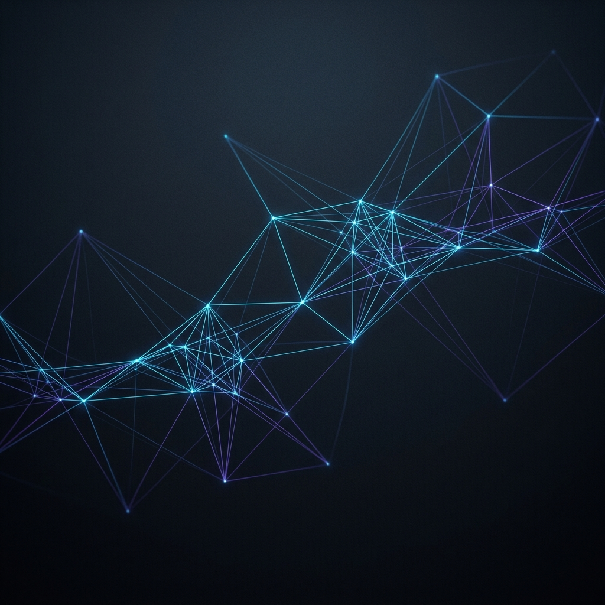

  

<h1 align="center">SURAJ SINGH</h1>

  <b>AI SYSTEMS ARCHITECT & AUTOMATION STRATEGIST</b> 
  <i>Designing high-fidelity autonomous orchestration for global scale.</i>

  
  
  

---

### ✦ CORE COMPETENCIES

**Cognitive Architecture & AI Agents**  
Architecting self-correcting agents and complex decision-making trees for autonomous lead qualification and multi-step business logic.

**High-Performance Automation**  
Engineering stealth-optimized scraping engines, automated telephony integrations, and real-time data synchronization layers.

**Systems Integration**  
Bridging LLM intelligence with legacy infrastructure via robust API design and event-driven microservices.

---

### ✦ TECH STACK

  
  
  
  
  
  
  

---

### ✦ PROJECT SHOWCASE
*Confidentiality Note: All source code for the following projects is proprietary. Demos available upon request.*

#### ▹ **DripOff Cold Caller**
An end-to-end autonomous outbound calling system. Features intelligent lead qualification, sentiment analysis, and dynamic response orchestration.

#### ▹ **Real Estate Automation Hub**
A centralized command center for high-volume lead scraping and automated agent dispatch, optimized for stealth and scale.

#### ▹ **AI ROI Architecture**
Precision analytics engine designed to stabilize revenue metrics and predict ROI for enterprise AI automation workflows.

---

### ✦ PERFORMANCE METRICS

  
  

---

  <a href="https://linkedin.com/in/your-profile">LinkedIn</a> • 
  <a href="mailto:your@email.com">Email</a> • 
  <a href="https://github.com/surajsingh21523-itachi">GitHub</a>

  &copy; 2026 SURAJ SINGH. ALL RIGHTS RESERVED.

